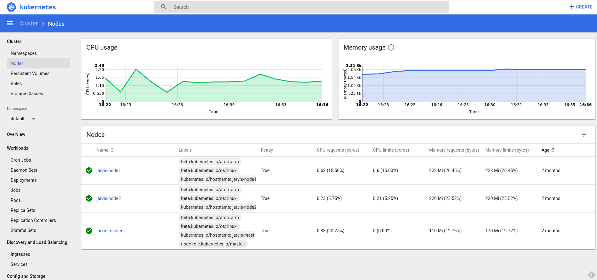

# Jarvis

[![License Apache 2][badge-license]](LICENSE)

* Master : 
* Develop: 

Features :

* [ ] Extract the energy consumption information from an EDF meter ([ERDF Teleinfo][])
* [ ] Analyze the indoor / outdoor temperature ([DHT22][])
* [ ] Measure air quality ([MQ135][])

Tools :

* [x] Management of containerized applications using [Kubernetes][]
* [ ] Monitoring solution with [Prometheus][] in the Kubernetes cluster
* [ ] Dashboards using [Grafana][] in the Kubernetes cluster
* [x] Custom DNS using [CoreDNS][] (See [k8s/coredns/README.md]())

Requirements:

* [RaspberryPI][]
* [Arduino][]

## Intallation

### Raspberry PI

Install [HypriotOS][] onto the SDCard:

    $ sdcard/jarvis_os_2.sh jarvis myssid mywifipassword Linux

See [ansible/README.md]() to setup the cluster using Ansible.

Install the dashboard :

    $ kubectl apply -f k8s/dashboard --record
    $ kubectl describe services kubernetes-dashboard --namespace=kube-system

Install CoreDNS (see *k8s/coredns/README.md*) as the internal Kubernetes DNS :

    $ kubectl apply -f k8s/coredns --record
    $ kubectl describe services kube-dns --namespace=kube-system
    Name:              kube-dns
    Namespace:         kube-system
    Labels:            k8s-app=coredns
                       kubernetes.io/cluster-service=true
                       kubernetes.io/name=CoreDNS
    Annotations:       kubectl.kubernetes.io/last-applied-configuration={"apiVersion":"v1","kind":"Service","metadata":{"annotations":{},"labels":{"k8s-app":"coredns","kubernetes.io/cluster-service":"true","kubernetes.io/na...
    Selector:          k8s-app=coredns
    Type:              ClusterIP
    IP:                10.96.0.10
    Port:              dns  53/UDP
    TargetPort:        53/UDP
    Endpoints:         10.36.0.5:53,10.44.0.2:53
    Port:              dns-tcp  53/TCP
    TargetPort:        53/TCP
    Endpoints:         10.36.0.5:53,10.44.0.2:53
    Port:              metrics  9153/TCP
    TargetPort:        9153/TCP
    Endpoints:         10.36.0.5:9153,10.44.0.2:9153
    Session Affinity:  None
    Events:            <none>

After a few minutes, check the installation:

    $ kubectl cluster-info
    Kubernetes master is running at https://192.168.1.36:6443
    Heapster is running at https://192.168.1.36:6443/api/v1/namespaces/kube-system/services/heapster/proxy
    CoreDNS is running at https://192.168.1.36:6443/api/v1/namespaces/kube-system/services/kube-dns/proxy

    $ kubectl get nodes
    NAME            STATUS    ROLES     AGE       VERSION
    jarvis-master   Ready     master    3h        v1.8.5
    jarvis-node1    Ready     <none>    3h        v1.8.5
    jarvis-node2    Ready     <none>    3h        v1.8.5

Install *heapster* :

    $ kubectl apply -f k8s/heapster --record

Then, you've got metrics :

    $ kubectl top  node
    NAME            CPU(cores)   CPU%      MEMORY(bytes)   MEMORY%
    jarvis-master   751m         18%       621Mi           81%
    jarvis-node2    142m         3%        388Mi           50%
    jarvis-node1    196m         4%        388Mi           50%

Install the Ingress default backend:

    $ kubectl apply  -f ingress/ingress-controller-rbac.yaml --record
    $ kubectl apply  -f ingress/ingress-default-backend.yaml --record
    $ kubectl apply  -f ingress/nginx/ --record

Before to add a new node, generate a new machineid, see : https://github.com/hypriot/image-builder-rpi/issues/167

Then add a new node :

    $ sudo kubeadm join --token ${TOKEN} ${MASTER_IP}:6443

### Cloud

You could use [Packer](https://packer.io) to create cloud image with Kubernetes installed.
See :

| Provider       | Support      | Version     |
| -------------- | -----------  | ------------|
| GCE            | [x]          | 1.6.5       |
| EC2            | [x]          | 1.6.5       |
| DigitalOcean   | [x]          | 1.6.5       |
| Azure          | [ ]          |             |

You could use [Terraform](https://terraform.io) to deploy some nodes.

## Development

See [DEV](DEV.md)

## Contributing

See [CONTRIBUTING](CONTRIBUTING.md).

## License

See [LICENSE](LICENSE) for the complete license.

## Changelog

A [changelog](ChangeLog.md) is available

## Contact

Nicolas Lamirault <nicolas.lamirault@gmail.com>

[badge-license]: https://img.shields.io/badge/license-Apache2-green.svg?style=flat

[RaspberryPI]: https://www.raspberrypi.org/
[PlatformIO]: http://platformio.org/
[Arduino]: https://www.arduino.cc/

[HypriotOS]: http://blog.hypriot.com/

[Kubernetes]: https://kubernetes.io/
[Mosquitto]: https://mosquitto.org/
[Grafana]: http://grafana.org/
[Prometheus]: https://prometheus.io/
[CoreDNS]: https://coredns.io
[Home Assistant]: https://home-assistant.io/

[Ansible]: https://www.ansible.com/

[ERDF Teleinfo]: http://www.erdf.fr/sites/default/files/ERDF-NOI-CPT_02E.pdf
[DHT22]: https://www.adafruit.com/products/385
[MQ135]: https://www.olimex.com/Products/Components/Sensors/SNS-MQ135/
