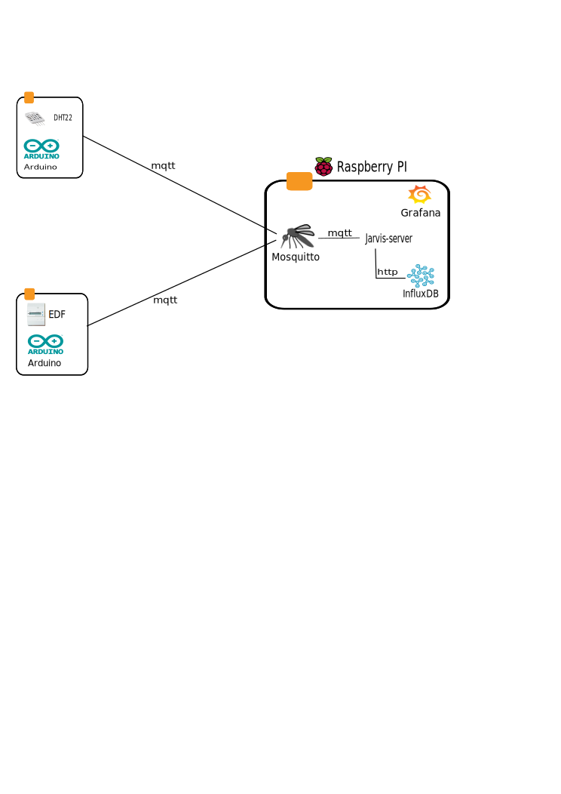

# Jarvis

[![License Apache 2][badge-license]](LICENSE)

Master :
* 

Develop:
* 

Features :

* Extract the energy consumption information from an EDF meter ([ERDF Teleinfo][])
* Analyze the indoor / outdoor temperature ([DHT22][])

Requirements:

* [RaspberryPI][]

* [Arduino][]
* [PlatformIO][]

* [Kubernetes][]

## Intallation

### Raspberry PI

Install the image into a SDCard:

    $ ./raspbian.sh sdbX

### Arduino

For *arduino* projects, you could :

* build all projects :

        $ make arduino-build-all

* build single project (for example dht):

        $ make arduino-build project=arduino/dht

#### DHT

#### Teleinfo

## Kubernetes

### Initialize

    $ make k8s-deps k8s-init

### Dashboard

    $ minikube dashboard

### Grafana

    $ kubectl create -f k8s/grafana/grafana-deployment.yaml
    $ kubectl get deployment
    NAME             DESIRED   CURRENT   UP-TO-DATE   AVAILABLE   AGE
    grafana-core     1         1         1            1           26s
    hello-minikube   1         1         1            1           1h
    $ kubectl get pods
    NAME                              READY     STATUS    RESTARTS   AGE
    grafana-core-1817908327-jhltn     1/1       Running   0          32s
    hello-minikube-2433534028-7t2ku   1/1       Running   0          1h

    $ kubectl create -f k8s/grafana/grafana-service.yaml
    You have exposed your service on an external port on all nodes in your
    cluster.  If you want to expose this service to the external internet, you may
    need to set up firewall rules for the service port(s) (tcp:30001) to serve traffic.

    See http://releases.k8s.io/release-1.2/docs/user-guide/services-firewalls.md for more details.
    service "grafana" created
    $ kubectl get service
    NAME             CLUSTER-IP   EXTERNAL-IP   PORT(S)    AGE
    grafana          10.0.0.4     nodes         3000/TCP   12s
    hello-minikube   10.0.0.118   nodes         8080/TCP   1h
    kubernetes       10.0.0.1     <none>        443/TCP    1h

    $ minikube service grafana --url
    http://192.168.99.100:30001

### Prometheus

    $ kubectl create -f k8s/prometheus/prometheus-core-configmap.yaml
    configmap "prometheus-core" created
    $ kubectl get configMap
    NAME              DATA      AGE
    prometheus-core   1         15s

    $ kubectl create -f k8s/prometheus/prometheus-service.yaml
    You have exposed your service on an external port on all nodes in your
    cluster.  If you want to expose this service to the external internet, you may
    need to set up firewall rules for the service port(s) (tcp:30900) to serve traffic.

    See http://releases.k8s.io/release-1.2/docs/user-guide/services-firewalls.md for more details.
    service "prometheus" created

    $ kubectl create -f k8s/prometheus/prometheus-deployment.yaml
    deployment "prometheus-core" created

    $ kubectl get deployment
    NAME              DESIRED   CURRENT   UP-TO-DATE   AVAILABLE   AGE
    grafana-core      1         1         1            1           18m
    hello-minikube    1         1         1            1           1h
    prometheus-core   1         1         1            1           7s

    $ minikube service prometheus --url
    http://192.168.99.100:30900

    $ kubectl create -f k8s/prometheus/prometheus-node-exporter-service.yaml
    service "prometheus-node-exporter" created
    $ kubectl create -f k8s/prometheus/prometheus-node-exporter-daemonset.yaml
    daemonset "prometheus-node-exporter" created
    $ kubectl get service
    NAME                       CLUSTER-IP   EXTERNAL-IP   PORT(S)    AGE
    grafana                    10.0.0.4     nodes         3000/TCP   28m
    hello-minikube             10.0.0.118   nodes         8080/TCP   2h
    kubernetes                 10.0.0.1     <none>        443/TCP    2h
    prometheus                 10.0.0.248   nodes         9090/TCP   17m
    prometheus-node-exporter   None         <none>        9100/TCP   30s
    $ kubectl get daemonset
    NAME                       DESIRED   CURRENT   NODE-SELECTOR   AGE
    prometheus-node-exporter   1         1         <none>          29s

#### Setup

On Grafana UI

* Configure Prometheus data source (Menu Data Sources / Add data source):
** Name: prometheus
** Type: Prometheus
** Url: http://prometheus:9090

* Import [Prometheus Stats](https://grafana.net/dashboards/159)
* Import [Kubernetes Cluster Monitoring](https://grafana.net/dashboards/162)

### Debug

* See Pods:

        $ kubectl get pods --all-namespaces

* Display nodes :

        $ kubectl get nodes

* Communicate with the minikube Docker daemon:

        $ eval $(minikube docker-env)
        $ docker ps

## Contributing

See [CONTRIBUTING](CONTRIBUTING.md).

## License

See [LICENSE](LICENSE) for the complete license.

## Changelog

A [changelog](ChangeLog.md) is available

## Contact

Nicolas Lamirault <nicolas.lamirault@gmail.com>

[badge-license]: https://img.shields.io/badge/license-Apache2-green.svg?style=flat

[RaspberryPI]: https://www.raspberrypi.org/
[PlatformIO]: http://platformio.org/
[Arduino]: https://www.arduino.cc/

[Kubernetes]: http://kubernetes.io/

[Mosquitto]: http://mosquitto.org/
[Grafana]: http://grafana.org/
[Prometheus]: https://prometheus.io/

[Ansible]: https://www.ansible.com/

[ERDF Teleinfo]: http://www.erdf.fr/sites/default/files/ERDF-NOI-CPT_02E.pdf
[DHT22]: https://www.adafruit.com/products/385
