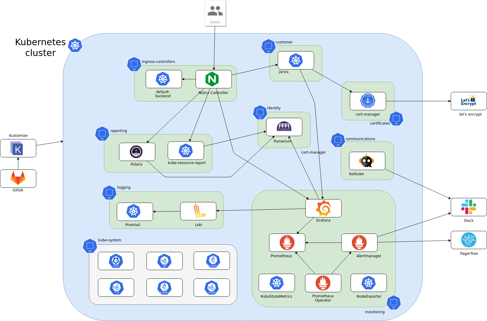
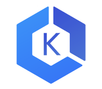
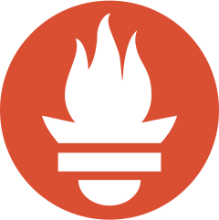
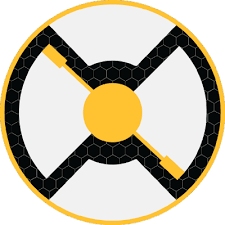

# Jarvis

[![License Apache 2][badge-license]](LICENSE)

* Master : 
* Develop: 

Kubernetes infrastructure

## Kubernetes cluster

&nbsp;

### Homelab ARM64

&nbsp;

### GKE

GKE (Google Kubernetes Engine) provides our Kubernetes cluster on Google Cloud

See [kubernetes/gke/](gke)

&nbsp;

### EKS

Amazon EKS provides our Kubernetes cluster on Amazon AWS

See [kubernetes/eks](eks)

&nbsp;

### AKS

AKS provides our Kubernetes cluster on Microsoft Azure Kubernetes Service

**TODO**
&nbsp;

## Monitoring

### Prometheus

Prometheus is used as the time series database for monitoring system

&nbsp;

### Grafana

Grafana is the UI of monitoring

&nbsp;

## CI/CD

### Tekton

The Tekton Pipelines project provides Kubernetes-style resources for declaring CI/CD-style pipelines.

&nbsp;

### Kaniko

Kaniko enables the build of OCI compliant containers without using the Docker daemon.

&nbsp;

## Serverless

&nbsp;

### Knative

Knative components build on top of Kubernetes,

&nbsp;

## Networking

### PiHole

An advertisement and Internet tracker blocking application which acts as a DNS sinkhole.

&nbsp;

### ExternalDNS

Makes Ingresses and Services available via DNS

&nbsp;

## Multimedia

&nbsp;

### Films

Automatically downloading movies via Usenet and BitTorrent.

&nbsp;

### TV

A PVR for Usenet and BitTorrent users. It can monitor multiple RSS feeds for new episodes of your favorite shows and will grab, sort and rename them

&nbsp;

## Tools

&nbsp;

### Kustomize

For the management of Kubernetes resources, kustomize is used.

&nbsp;

## Installation

&nbsp;

## Contributing

See [CONTRIBUTING](CONTRIBUTING.md).

&nbsp;

## License

See [LICENSE](LICENSE) for the complete license.

&nbsp;

## Changelog

A [changelog](ChangeLog.md) is available

&nbsp;

## Contact

Nicolas Lamirault <nicolas.lamirault@gmail.com>

[badge-license]: https://img.shields.io/badge/license-Apache2-green.svg?style=flat

[RaspberryPI]: https://www.raspberrypi.org/

[HypriotOS]: http://blog.hypriot.com/

[Kubernetes]: https://kubernetes.io/
[Grafana]: http://grafana.org/
[Prometheus]: https://prometheus.io/
[CoreDNS]: https://coredns.io
[Home Assistant]: https://home-assistant.io/

[ERDF Teleinfo]: http://www.erdf.fr/sites/default/files/ERDF-NOI-CPT_02E.pdf
