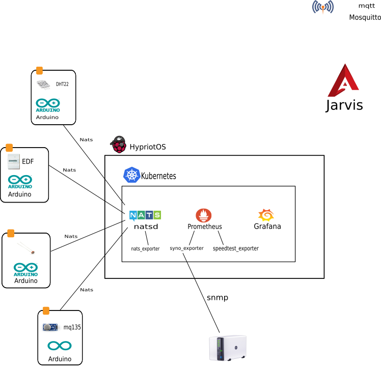

# Jarvis

[![License Apache 2][badge-license]](LICENSE)

* Master : 
* Develop: 

Features :

* Extract the energy consumption information from an EDF meter ([ERDF Teleinfo][])
* Analyze the indoor / outdoor temperature ([DHT22][])
* Monitoring a Synology NAS using SNMP

Tools :

* Management of containerized applications using [Kubernetes][]
* Monitoring solution with [Prometheus][]
* Dashboards using [Grafana][]

Requirements:

* [RaspberryPI][]
* [Arduino][]

## Intallation

### Raspberry PI

Install [Kubernetes][] with [HypriotOS][] onto the SDCard:

    $ sdcard/jarvis.sh jarvis myssid mywifipassword Linux

Log into the OS:

    $ ssh pirate@x.x.x.x
    HypriotOS/armv7: pirate@jarvis in ~
    $ curl -LO --progress-bar https://raw.githubusercontent.com/zeiot/jarvis/refactoring/sdcard/jarvis_k8s.sh
    $ chmod +x jarvis_k8s.sh
    $ ./jarvis_k8s.sh

## Arduino

* For *arduino* projects, we use [PlatformIO][], initialize it:

        $ make arduino-init

* For project (here *dht*) setup arduino devices client configurations:

        $ cp arduino/dht/src/config.sample.h arduino/dht/src/config.h
        # edit config.h to customize your requirements

* Build project (for example dht):

        $ make arduino-build project=arduino/dht

* Connect an Arduino, then upload it :

        $ make arduino-upload project=arduino/dht

## Synology

Configure the SNMP on the Synology NAS. Go to the Control Panel, choose Terminal & SNMP and make the configuration on the SNMP tab (Choose SNMP v1).

## Development

### Kubernetes

#### Initialize

    $ make k8s-deps k8s-init

    $ kubectl version
    Client Version: version.Info{Major:"1", Minor:"2", GitVersion:"v1.2.4", GitCommit:"3eed1e3be6848b877ff80a93da3785d9034d0a4f", GitTreeState:"clean"}
    Server Version: version.Info{Major:"1", Minor:"3", GitVersion:"v1.3.5", GitCommit:"b0deb2eb8f4037421077f77cb163dbb4c0a2a9f5", GitTreeState:"clean"}

    $ kubectl cluster-info
    Kubernetes master is running at https://192.168.99.100:8443
    kubernetes-dashboard is running at https://192.168.99.100:8443/api/v1/proxy/namespaces/kube-system/services/kubernetes-dashboard

#### Dashboard

    $ minikube dashboard

#### Grafana

    $ kubectl create -f k8s/grafana/grafana-deployment.yaml
    $ kubectl get deployment
    NAME             DESIRED   CURRENT   UP-TO-DATE   AVAILABLE   AGE
    grafana-core     1         1         1            1           26s
    hello-minikube   1         1         1            1           1h
    $ kubectl get pods
    NAME                              READY     STATUS    RESTARTS   AGE
    grafana-core-1817908327-jhltn     1/1       Running   0          32s
    hello-minikube-2433534028-7t2ku   1/1       Running   0          1h

    $ kubectl create -f k8s/grafana/grafana-service.yaml
    You have exposed your service on an external port on all nodes in your
    cluster.  If you want to expose this service to the external internet, you may
    need to set up firewall rules for the service port(s) (tcp:30001) to serve traffic.

    See http://releases.k8s.io/release-1.2/docs/user-guide/services-firewalls.md for more details.
    service "grafana" created
    $ kubectl get service
    NAME             CLUSTER-IP   EXTERNAL-IP   PORT(S)    AGE
    grafana          10.0.0.4     nodes         3000/TCP   12s
    hello-minikube   10.0.0.118   nodes         8080/TCP   1h
    kubernetes       10.0.0.1     <none>        443/TCP    1h

    $ minikube service grafana --url
    http://192.168.99.100:30001

#### Prometheus

    $ kubectl create -f k8s/prometheus/prometheus-core-configmap.yaml
    configmap "prometheus-core" created
    $ kubectl get configMap
    NAME              DATA      AGE
    prometheus-core   1         15s

    $ kubectl create -f k8s/prometheus/prometheus-service.yaml
    You have exposed your service on an external port on all nodes in your
    cluster.  If you want to expose this service to the external internet, you may
    need to set up firewall rules for the service port(s) (tcp:30900) to serve traffic.

    See http://releases.k8s.io/release-1.2/docs/user-guide/services-firewalls.md for more details.
    service "prometheus" created

    $ kubectl create -f k8s/prometheus/prometheus-deployment.yaml
    deployment "prometheus-core" created

    $ kubectl get deployment
    NAME              DESIRED   CURRENT   UP-TO-DATE   AVAILABLE   AGE
    grafana-core      1         1         1            1           18m
    hello-minikube    1         1         1            1           1h
    prometheus-core   1         1         1            1           7s

    $ minikube service prometheus --url
    http://192.168.99.100:30900

    $ kubectl create -f k8s/prometheus/prometheus-node-exporter-service.yaml
    service "prometheus-node-exporter" created
    $ kubectl create -f k8s/prometheus/prometheus-node-exporter-daemonset.yaml
    daemonset "prometheus-node-exporter" created
    $ kubectl get service
    NAME                       CLUSTER-IP   EXTERNAL-IP   PORT(S)    AGE
    grafana                    10.0.0.4     nodes         3000/TCP   28m
    hello-minikube             10.0.0.118   nodes         8080/TCP   2h
    kubernetes                 10.0.0.1     <none>        443/TCP    2h
    prometheus                 10.0.0.248   nodes         9090/TCP   17m
    prometheus-node-exporter   None         <none>        9100/TCP   30s
    $ kubectl get daemonset
    NAME                       DESIRED   CURRENT   NODE-SELECTOR   AGE
    prometheus-node-exporter   1         1         <none>          29s

#### Traefik

    $ kubectl create -f k8s/traefik/traefik-deployment.yaml
    deployment "traefik-ingress-controller" created

    $ kubectl get deployment --namespace=kube-system
    NAME                         DESIRED   CURRENT   UP-TO-DATE   AVAILABLE   AGE
    traefik-ingress-controller   1         1         1            1           2m

    $ kubectl create -f k8s/traefik/traefik-service.yaml
    service "traefik-web-ui" created

    $ kubectl get service --namespace=kube-system
    NAME                   CLUSTER-IP   EXTERNAL-IP   PORT(S)         AGE
    kube-dns               10.0.0.10    <none>        53/UDP,53/TCP   19h
    kubernetes-dashboard   10.0.0.150   nodes         80/TCP          19h
    traefik-web-ui         10.0.0.124   <none>        80/TCP          2m

    $ kubectl create -f k8s/traefik/traefik-ingress.yaml
    ingress "traefik-web-ui" created

    $ kubectl get ingress --namespace=kube-system
    NAME             RULE               BACKEND   ADDRESS   AGE
    traefik-web-ui   -                                      2m
    traefik-ui.local
                       /                  traefik-web-ui:web

    $ echo "$(minikube ip) traefik-ui.local" | sudo tee -a /etc/hosts

We should now be able to visit *traefik-ui.local* in the browser and view the Traefik Web UI.

#### Mosquitto

    $ kubectl create -f k8s/mosquitto/mosquitto-deployment.yaml
    deployment "mosquitto" created

    $ kubectl get deployment
    NAME              DESIRED   CURRENT   UP-TO-DATE   AVAILABLE   AGE
    [...]
    mosquitto         1         1         1            1           15m

    $ kubectl create -f k8s/mosquitto/mosquitto-service.yaml
    service "mosquitto" created

    $ kubectl get service
    NAME                       CLUSTER-IP   EXTERNAL-IP   PORT(S)    AGE
    [...]
    mosquitto                  10.0.0.31    nodes         1883/TCP   16m

    $ minikube service mosquitto --url
    http://192.168.99.100:30183

You should now testing the Mosquitto server:
In Terminal window 1 type:

    $ mosquitto_sub -v -h 192.168.99.100 -p 30183 -t k8s/test

In Terminal window 2 type:

    $ mosquitto_pub -d -h 192.168.99.100 -p 30183 -t k8s/test -m "Hello Jarvis!"
    Client mosqpub/14361-nlamiraul sending CONNECT
    Client mosqpub/14361-nlamiraul received CONNACK
    Client mosqpub/14361-nlamiraul sending PUBLISH (d0, q0, r0, m1, 'k8s/test', ... (13 bytes))
    Client mosqpub/14361-nlamiraul sending DISCONNECT

When you have done the second statement you should see this in the Terminal 1 window:

    k8s/test Hello Jarvis!

#### Setup

On Grafana UI

* Configure Prometheus data source (Menu Data Sources / Add data source):
** Name: prometheus
** Type: Prometheus
** Url: http://prometheus:9090

* Import [Prometheus Stats](https://grafana.net/dashboards/159)
* Import [Kubernetes Cluster Monitoring](https://grafana.net/dashboards/315)

#### Debug

* See Pods:

        $ kubectl get pods --all-namespaces

* Display nodes :

        $ kubectl get nodes

* Communicate with the minikube Docker daemon:

        $ eval $(minikube docker-env)
        $ docker ps

### Arduino

* Initialize [PlatformIO][]:

        $ make arduino-init

* Build project :

        $ make arduino-build project=xxx

* Upload project :

        $ make arduino-upload project=xxx

## Contributing

See [CONTRIBUTING](CONTRIBUTING.md).

## License

See [LICENSE](LICENSE) for the complete license.

## Changelog

A [changelog](ChangeLog.md) is available

## Contact

Nicolas Lamirault <nicolas.lamirault@gmail.com>

[badge-license]: https://img.shields.io/badge/license-Apache2-green.svg?style=flat

[RaspberryPI]: https://www.raspberrypi.org/
[PlatformIO]: http://platformio.org/
[Arduino]: https://www.arduino.cc/

[HypriotOS]: http://blog.hypriot.com/

[Kubernetes]: https://kubernetes.io/
[Mosquitto]: https://mosquitto.org/
[Grafana]: http://grafana.org/
[Prometheus]: https://prometheus.io/

[Ansible]: https://www.ansible.com/

[ERDF Teleinfo]: http://www.erdf.fr/sites/default/files/ERDF-NOI-CPT_02E.pdf
[DHT22]: https://www.adafruit.com/products/385
